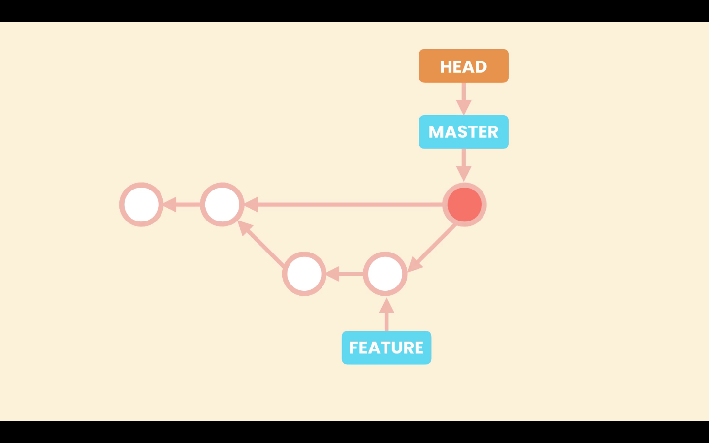
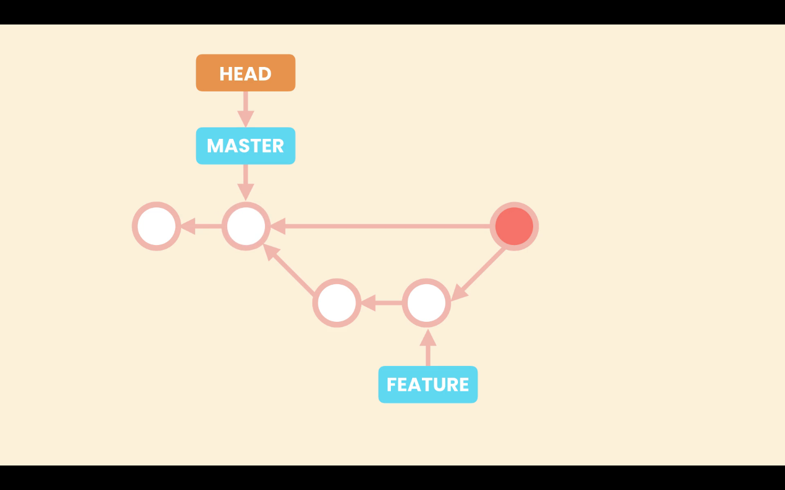
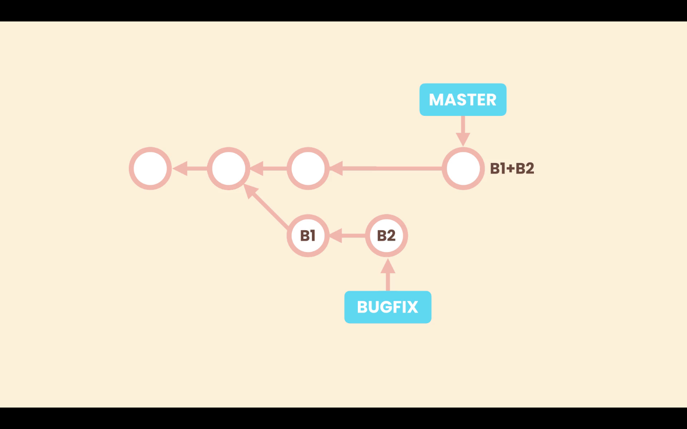

# Merging

[Git Merging docs](https://git-scm.com/book/pt-br/v2/Git-Branching-Basic-Branching-and-Merging)

Merging is about bringing changes from one brach to another.

In Git we have two types of merges:
- Fast-forward merges
- 3-way mergers

## Fast-forward merges

When we create new brach, let's call it ***bugfix***, from the ***main*** branch, both branches, ***main*** and ***bugfix***, will be pointing to the same commit.


Then when we switch to ***bugfix*** and start working on it and committing to it, the ***bugfix*** branch moves forward and **main** stays in the same place. This branches have not diverged and there is a direct linear path between them.


This way all Git has to do to merge the changes is to bring the master pointer forward. This is the fast-forward merge. Git run this type of merge when there is a direct linear path between the two branches.


## 3-way merge

A 3-way merge happens when we apply some changes to the ***main*** branch, and commit them, after we created the ***bugfix*** branch. So we have some changes in ***main*** that do not exist in the ***bugfix*** branch. In this situation the two branches are diverged.


In this situation, when we run a merge git create a new commit that merges this two branches. This is called a 3-way merge because this merge commit is base in three different commit, the common ancestor of both branches, which has the before code, and the tips of both branches, tha contain the after code.


# Fast-forward Merges

## Git log for branches `--graph`

To have a better visualizations of branches with `git log`, it is better to include the `--graph` option. It will produce an output where we are able to better view the branch path.
```zsh
git log --graph
```

In the log we can see that the branch **fast-forward-merge** is one commit ahead of **main**, and that there is a linear path between them. So this could merges by the fast-forward method.

## Merge branch fast-forward

To merge the **fast-forward-merge** branch into **main**, we first should have committed all of our work in that branch and then we switch to **main**. In the **main** branch we run the merge with the command:
```zsh
git merge fast-forward-merge
```

After that we can run `git log` to see the result.

## Merge without fast-forward `--no-ff`

It is also possible to enforce a non fast-forward merge with the command:
```zsh
git merge --no-ff <branch-name>
```
With this we tell Git that, although it is possible to have a fast-forward merge, don't do it, and that it should create a new commit to merge **main** with another branch.

When we run the command:
```zsh
git merge --no-ff no-fast-forward-merge
```
Our default editor will open, with the default merge commit message ***Merge branch 'no-fast-forward-merge'***. We don't need to modify the message, and we can add details if needed.

Now when we can run `git log` to see the new merge commit.

The new branch for this example called **no-fast-forward-merge**, then there were three commits on it, and at last was merged into **main** in the commit, that was triggered by the merge command with the `--no-ff` option.

## Disable fast-forward merges

It is possible to disable fast-forward merges, that why all mergers Git performs will be non fast-forward, even if it is possible to have a fast forward merge.

- Disable for a single repository: `git config merge.ff false`
- Disable globally `git config --global merge.ff false`


# Three-way Merges

The 3-way-merge is implicit when the branches to merge diverge. This happens when changes are made to the original branches after the creation of the new branch.

We have created a new branch from **main**, called **3-way-merge**, in the moment of creation both branches are pointing to the same commit.
```zsh
git log --graph
```

When we commit to **3-way-merge**, this branch will move forward, but will have a linear path to **main**. This linear path is broken when changes are applied to **main** before the merge.

Here we have switched to **main** and made 2 commits. So now the **main** branch has diverged from **3-way-merge**.
```zsh
git log --oneline --graph
```

Now when we run a merge Git will run a 3-way-merge. It will open the default editor with a commit message, when add more details if needed to the commit message.

In the log we can see the merge commit. After a merge we can deleted the merged branch **3-way-merge**.


# Viewing Merged and Unmerged Branches

## List merge branches `--merged`

When we are finished working in a branch, we should merge it into **main**, and afterwards delete it.

To view the list of merged branches run the command:
```zsh
git branch --merged
```

## List unmerged branches `--no-merged`

To view the list of unmerged branches run the command:
```zsh
git branch --no-merged
```


# Merge Conflicts

Very often when we are merging branches we run into conflicts. Conflicts happen when:

- The same line of code was been changed in two different ways, in the merged branches.
- A given file is changes in one branch, but delete in the other branch.
- The same file is added in two different branches with different content.

When conflict happens Git can not merge the branches automatically, and we must step in. After running the command: 
```zsh
git merge <name-of-branch>
```
We will be warned and in `git status`
```zsh
❯ git status

On branch main

You have unmerged paths.
  (fix conflicts and run "git commit")
  (use "git merge --abort" to abort the merge)

Unmerged paths:
  (use "git add <file>..." to mark resolution)
    both modified:   main.js

no changes added to commit (use "git add" and/or "git commit -a")
```

As we can see `Unmerged paths` were being the conflict it.

Edit the file manually to solve the conflict. When solving conflicts we should avoid at all cost adding new code.

After finishing resolving the conflict, we must add the file to the **Staging Area**, with `git add <file>`, and commit it. Because this is a merge commit, we don't need to pass a message, we can accept the default message, just run `git commit`.


# Graphical Merge Tools

We can use external merge tools:
- Kdiff
- P4Merge
- WinMerge (Windows only)

Other tools like GitKraken or IDEs, may even have better functionalities.


# Aborting a Merge

In case we want to abort a merge that has conflicts we can use the `--abort` option.
```zsh
git merge --abort
```


# Undoing a Faulty Merge

In case we need to undo a merge we have two options:
1. Remove the merge commit, as if it was never there (only if we didn't shared the repository with others)
2. Revert the merge commit

## 1. Remove the merge commit

After a merge we have the **main** and **HEAD** pointers, pointing to the last commit, that is the merge commit.



With the reset command we will move both pointers to the last commit before the merge. And remove the merge commit.



Run the command:
```zsh
git reset --hard HEAD~1
```

After we run the command the merge commit does not have any commit or pointer pointing to it. So for Git this garbage, once in a while Git looks for commits like this and removes them.

### Resting the ***HEAD*** options

When resting the **HEAD** pointer, we have three option:
- soft
- mixed
- hard

#### Option `--soft`

When we reset the **HEAD** using the `--soft` option, Git will have the **HEAD** pointer pointing to the indicated commit, in this case `HEAD~1`, so go back one commit, in the ***Repository***. But the ***Staging Area*** and ***Working Directory*** are not affected.
```zsh
git reset --soft HEAD~1
```


#### Option `--mixed`

In this case Git is going to apply the new snapshot to both the ***Repository*** and ***Staging Area***, local changes in the ***Working Directory*** will not be affected.

Using the `--mixed` option, which is the default option so we do not need to specify it.
```zsh
git reset HEAD~1
```


#### Option `--hard`

Using the `--hard` option Git will apply the new snapshot to all environments ***Working Directory***, ***Staging Area***, ***Repository***. This was the state we where before stating the merge.


## 2. Revert the merge commit

If we have shared our history instead of undoing the merge commit we have to revert the last commit.

A merge commit has two parents so have to tell git how we want to revert the changes. Because our merge commit is in the **main** branch the first parent should also be in the **main** branch. To do this we use the command:
```zsh
git revert -m 1 HEAD
```

In the `-m 1`, we are specifying the first parent. And `HEAD` is representing the target commit, the last commit.

Running this Git will open the default editor with a default message for the revert commit.

### Option `-m`

From `git revert --help`

> -m parent-number, --mainline parent-number
> Usually you cannot revert a merge because you do not know which side of the merge should be considered the mainline. This option specifies the parent number (starting from 1) of the mainline and allows revert to reverse the change relative to the specified parent.


# Squash Merging

In squash merging we first combine the commits from the branch, and then we merge. This is useful in situations where the commits in the branch are not good quality commits, or simply we don't need the history from the branch.

- To fined grain
- Maybe we have mixed different things in each commit



This new commit is not a merge commit, because it does not have two parents. It is lacking the reference to **B2**, the last commit from the **bugfix** branch. It is just a regular commit added on top of ***`main`*** that combines the commits from the other branch.

When we delete the **bugfix** branch, we are left with a clean linear history. This is the benefit of Squash merging. But usually we should only apply it to short lived branches with bad history.


To perform a squash merge use the command:
```zsh
git merge --squash <name-of-branch>
```
Git will create a new commit, called a ***`Squash commit`***, that combines the changes made in the merged branch, and it will changes to the ***Staging Area***. Then we just need to commit then normally.
```zsh
git merge --squash bugfix
```

## List merged and unmerged branches

If we run `git branch --merged`, to list all the merged branches we will not see the **bugfix** branch. Because this branch was not actually merged. So it best to delete it after the squash merge, but in the situation we have to use `-D` instead of `-d`, or Git will throw an error.
```zsh
git branch -D bugfix
```

## Conflict in Squash merge

In case we run into conflicts when running a **Squash merge**, we can resolve this conflicts as in a normal merge.
