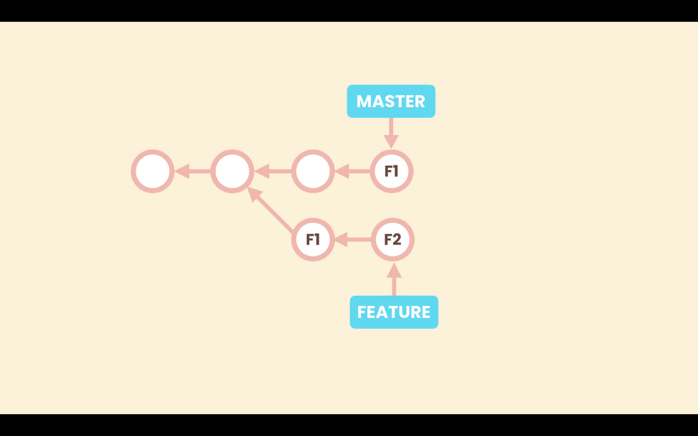

# Cherry Picking

Imagine we are working in a branch that is diverged from **main**, and we need one of the commits from this branch in **main**. Just one commit, not a full merge.



To achieve this we use cherry picking.

First we must be in the `main`, and then there we run the command:
```zsh
git cherry-pick <commit-ID>
```

Then we must make a commit. We do not need to specify a message, when we run `git commit`, the default editor will open with a default message based in the commit we are cherry picking, we can accept it or change it.


# Picking a File from Another Branch

Sometimes we may need a single file from one branch in another branch. Unlike cherry picking that merges a commit, we can bring only one file. For this operation we use the `restore` command. In the branch that needs the files we run the command:
```zsh
git restore --source=<name-of-branch> -- <file-name>
```
Git will update the **Working Directory** with the latest version of that file from the target branch

Let's suppose we need a file named `config.rb` from an unmerged branch called **feature** in `main`, so we run the command:
```zsh
git restore --source=feature -- config.rb
```
