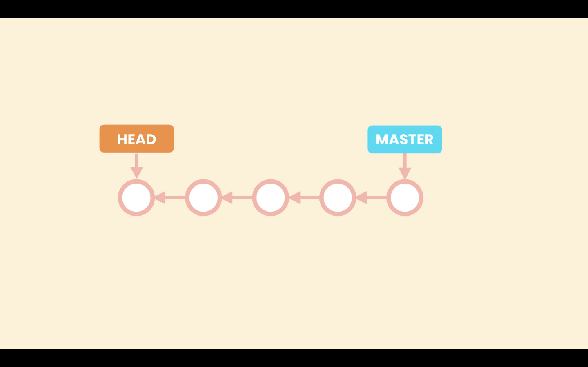

# Checking Out a Commit

When we need to see the complete project in a given point in time we can check out a given commit, and it will restore our **Working Directory** to that point in time. Using the command:
```zsh
git checkout <commit>
```

## Detached HEAD state

In Git each commit is pointing to the last commit. That is how Git maintains history.


Until now all the commits created are part of a branch, the `master` or `main`. The way Git represents branches is using a pointer, so `master` is pointing to the last commit created. As we create new commits master moves forward to point to the last commit.


Because we can have multiple branches Git needs to know in which branch we are working at the moment. To do that Git uses another special pointer called `HEAD`, so `HEAD` points to the current branch we are working on. In this case `master`. We have seen this in the `git log` command **`(HEAD -> main)`**.

When we checkout a particular commit, the `HEAD` pointer will move to that commit, thats is what is called a `detached HEAD`. `HEAD` is not pointing to a branch but is pointing to a specific commit.



In this situation we should not create new commits. If we make changes and create a new commit, that commit will be added where the `HEAD` pointer is at the moment. But eventual we will attach the HEAD pointer to a branch, so the commit created it is not reachable by any other commit or pointer, like a dead commit. Git checks for commits like these periodically and removes them to save space.


Last commit:


If we run `git log --oneline --all` command while in a detached `HEAD` state we can see the `master` or `main` pointing to the last commit and `HEAD` point to the specific commit. If we use `git log --oneline` without the the `--all`, we will not see the commits after made after the commit `HEAD` is pointing to.

To attache the `HEAD` pointer to the branch, use this command:
 ```zsh
git checkout <name of the branch>
``` 
For example, `git checkout main`.
