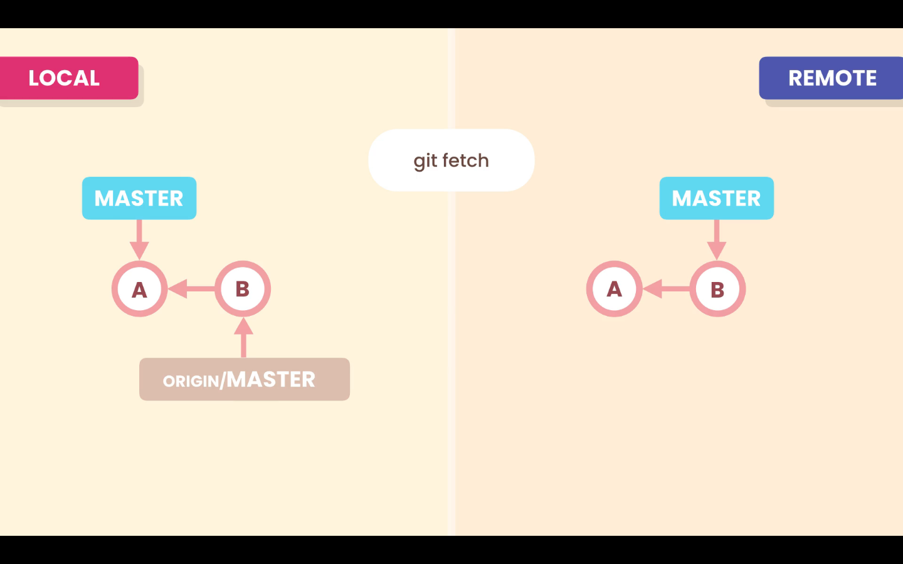

# Fetching

The **Local Repository** and **Remote Repository** work independently. If we have new commits in our **Remote Repository**, because another team member pushed is work, our **Local Repository** will not be aware of it.

We have to use the command:
```zsh
git fetch <remote-repository>
```
To download the new commits, when we do so the `origin/main` pointer will move forward, and point to the new commits. But our working directory will not be updated
```zsh
git fetch origin
```

Optionally we can specify a branch to the `fetch` command:
```zsh
git fetch <remote-repository> <branch-name>
```
```zsh
git fetch origin bugfix
```



To update our branch with the changes downloaded from the `fetch` command, we have to merge them with our branch, with the command:
```zsh
git merge origin/master
```


## Remote and Local branches

With the command:
```zsh
git branch -vv
```
We can see how the remote and local branches are diverging.

Our local `main` branch is connect to the remote `origin/main` branch. And the local branch is ahead by 2 commits.
