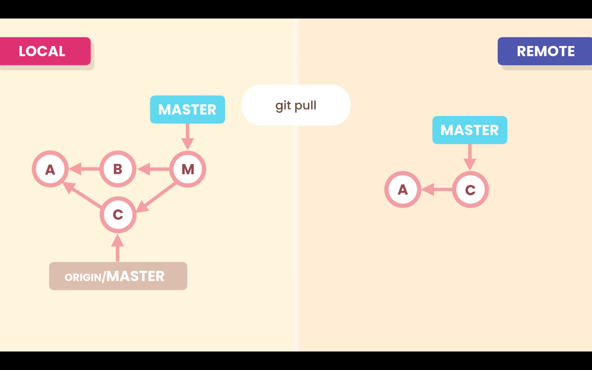

# Pulling

## `git pull`

```zsh
git pull
```

The `pull` command combines the `fetch` and `merge` together. With this command Git will download the commits in the **Remote Repository** branch and merge them with the **Local Repository** branch.



By default Git will perform a fast-forward merge if possible, if it is not possible like in the image above, git will run a 3-way merge.

## `git pull --rebase`

```zsh
git pull --rebase
```

With the command `git pull --rebase` Git will rebase **Local Repository** branch on top of the **Remote Repository** branch.


