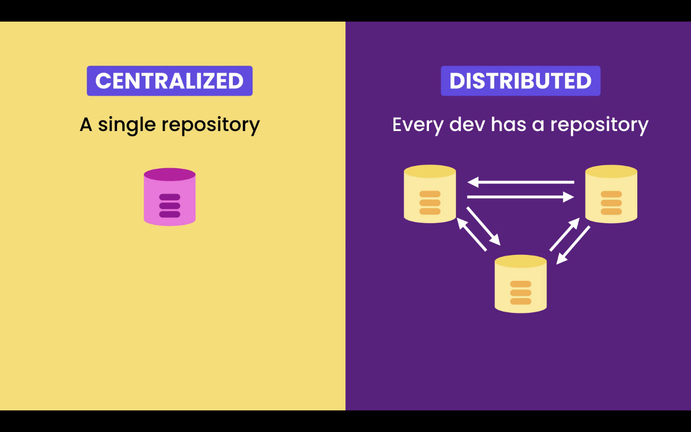
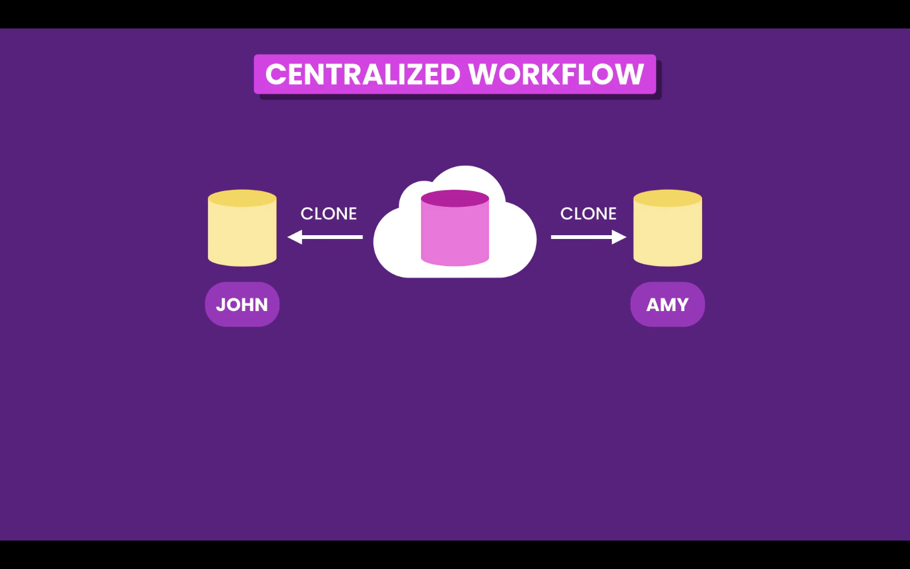
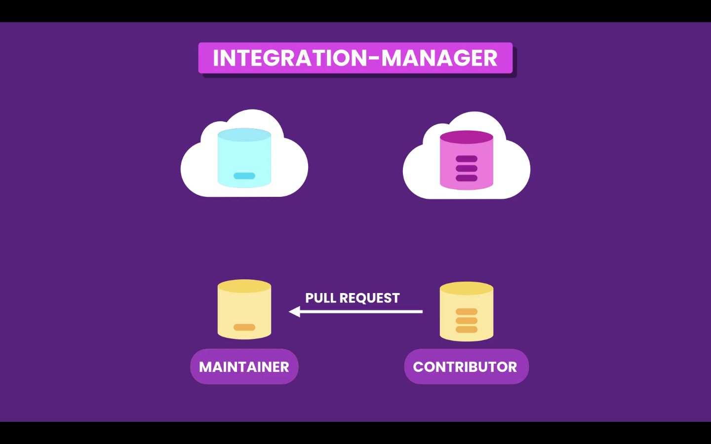

# Workflows

With a distributed Version Control System like Git it would be possible for each developer to synchronize his work with each member of the team.

But, usually, this is not the best solution, it's to complex and more susceptible to errors. Instead it is better to use, what is called, a **Centralized Workflow**, each developer still keeps a full local copy of the repository, but instead of syncing with each other they sync with a **Remote Repository**.

With this model we don't have a single point of failure. If the **Remote Repository** fails we still can sync the repository with each other.

**Remote Repository** examples:

- Company private servers
- Cloud hosting services
  - [GitHub](https://github.com/)
  - [GitLab](https://gitlab.com/)
  - [Bitbucket](https://bitbucket.org/)

## Centralized Workflow

The collaborating workflow usually follows this steps.

### 1. Clone the Remote Repository

First team members clone the repository from the **Remote Repository**. By cloning, they will have a full copy of the repository on their machine.

### 2. Push to Remote Repository

Team members start working and commit to their **Local Repository**. At any time they can use the **`push`** command to sync (upload) their work to the **Remote Repository**, so it is shared with team members.

### 3. Pull from Remote Repository

Any other team member can use the **`pull`** command to bring (download) new changes to their **Local Repository**.

## Workflow for open-source projects

In a open-source project, usually only the maintainers have push access to the original **Remote Repository**. Other developers that want to contribute to the project first have to **fork** the **Remote Repository**, in order to have a copy of it.

Afterwards a contributor developer can clone the repository and start working.

When developer is done we can **`push`** changes to the forked **Remote Repository**, and then send a **Pull Request** to the maintainers of the project. Who are notified, and can pull and review the changes. And if they agree with the changes they can merge them with the original **Remote Repository**.

