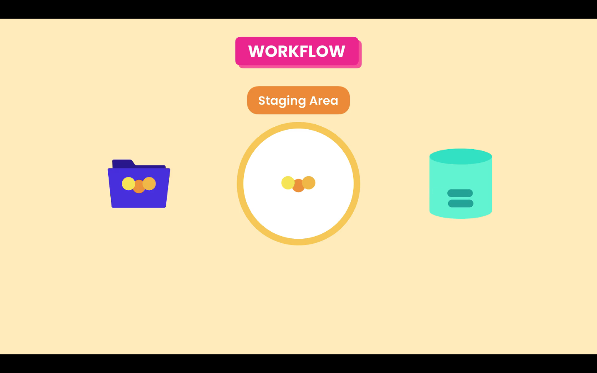

# Git Workflow

## Workflow

In the daily work, we modify one or more files. When we believe that we reach a point that we want to record we commit those changes into the repository. Creating a commit it is like taking a snapshot of our project.

In Git there is a special area or a special intermedial step that doesn't exist in most other version control systems, between the ***Working Directory*** and the ***Repository***. Its called the ***Staging Area*** or the ***Index***. Files in these area are the one that will be in the next commit or the next snapshot.



First we add our changes to the **Staging Area**, and there we are able to review our changes, and then we'll make a commit. The proposed  snapshot will get permanently stored in our repository. If some of the changes shouldn't be recorded as part of the next snapshot, we can unstage that file and commit them as part of another snapshot, that the basic git workflow.

## Git commands

### git add

To add files to the staging area we use the `git add` command:

```zsh
git add file1 file2
```

We can add multiple files at the same time or use `git add .` to add all files, that have been changed, in the current directory recursively.

### git commit

To record the snapshot to the repository we use the `git commit` command, with the `-m` and a meaningful message, about the changes we have made.

```zsh
git commit -m "Initial commit"
```

Each commit contains a unique identifier, and also information of what was changed:

- ID
- Message
- Date / time
- Author
- Complete snapshot

To view the details of commits in a repository, we can use the `git log` command. 

This command shows the commit history, including the ID, author, date, and message.

```zsh
commit 9z8y7x6w5v4u3t2s1r0q9p8o7n6m5l4k3j2i1h0g
Author: Another User <userr@example.com>
Date:   Tue May 15 14:20:00 2024 +0200

    Fix issue with user authentication flow
```
Unlike many other version control systems git doesn't stores deltas or what was changed, git stores the full content. Git is very efficient in data storage, it compresses file contents and doesn't store duplicate content.
