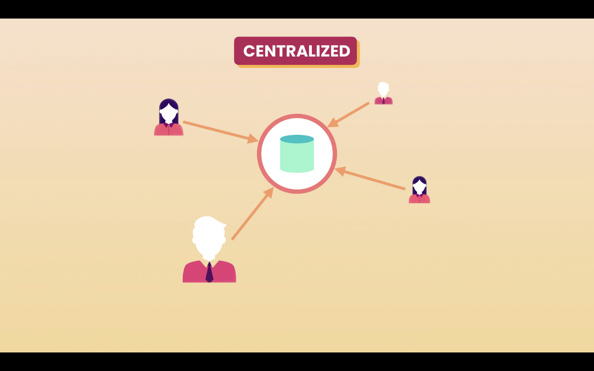
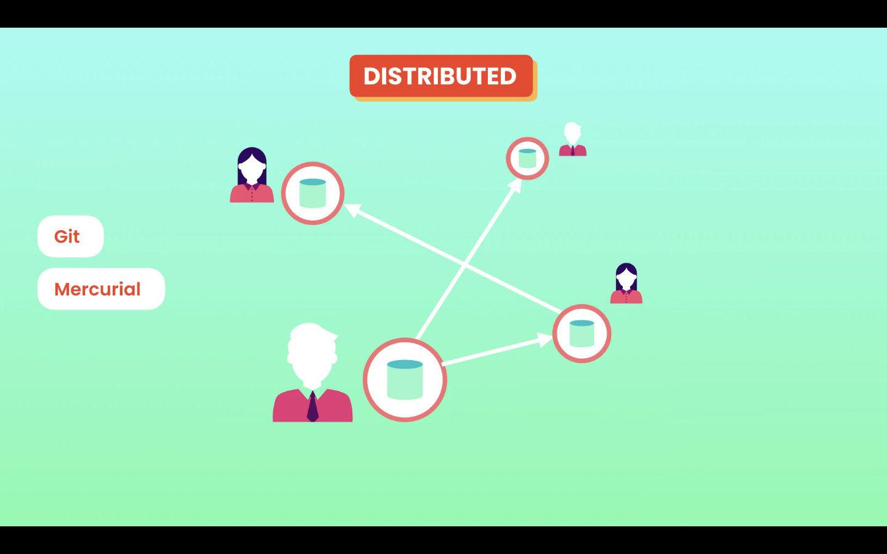

# Git

**Git** is the most popular **Version Control System (VCS)** in the world.

Git records the changed made to our code in a special database called repository. It enable us to look into our project history, and see what changes where made, by whom, when and why. And if we mess something it we can easily revert our project back to an earlier state.

## Version Control Systems categories

### Centralized

In a **Centralized** system all team members connect to a central sever to get the latest copy of the code, and to share their changes with others.

Examples:
- Subversion
- Microsoft Team Foundation Server

The problem with a Centralized VCS is the single point of failure, if the server gos offline it is impossible to collaborate, or continue to take snapshots of the code.

### Distributed

In a **Distributed** system each team member as a full copy of the code and repository in ts machine, if the server goes offline they can keep on working

Examples:
- Git
- Mercurial

## Why Git?

Reasons to choose Git
- Open Source
- Super Fast
- Scalable
- It is free

Operations like branching and merging are painful in other VCS.

## Ways to use Git

### Command-line

The command-line is the most common, and probably the fastest way to use Git. Most GUI tools have limitations.

Sometimes GUI tools might not be available. In case for example if we connect to a server remotely and do not have permission to install a GUI tool.

### Code Editors & IDEs

Most code editors these days have built-in GUI tools and extensions to use Git.

- Visual Studio Code Extensions:
    - GitLens

### Graphical User Interfaces

In the [Git](https://git-scm.com/) website there is a [complete list of GUI tools](https://git-scm.com/download/gui/mac) for all the main platforms Mac, Linux and Windows.

The most popular ones are:
- [GitKraken](https://www.gitkraken.com/)
- [SourceTree](https://www.sourcetreeapp.com/)