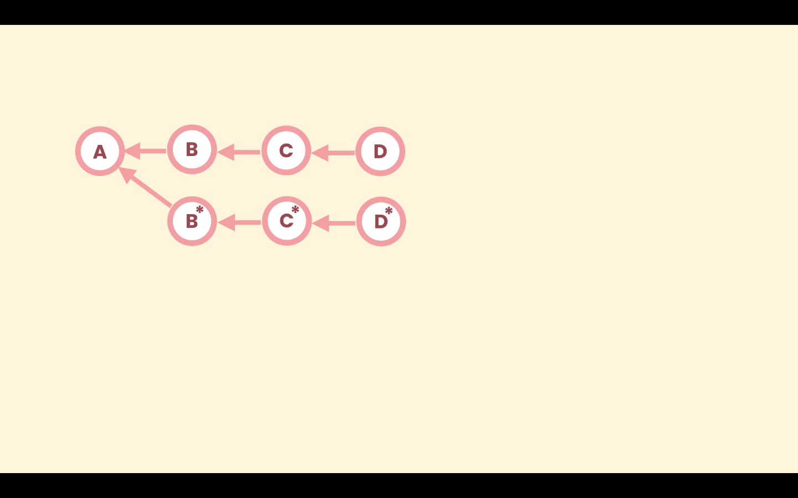

# Amending the Last Commit

In situations where we made a mistake in the last commit, like a typo in the message, or adding a file that shouldn't be there, we can amend the commit. We don't actually modify the last commit, in really Git creates a new commit, because git commits are immutable.

## Amend a commit message or include changes

With the `--amend` option we can add more changes to the last commit or modify the commit message. In case we need to add more changes in the code to the last commit, first we need to stage them and the run the command:
```zsh
git commit --amend -m <message>
```
Optionally we can omit the message and accept the last message, so run `git commit --amend` will open the default editor with the previous commit message.
```zsh
git commit --amend
```

## Remove a file from the last commit

To remove a file from the last commit, first we need to use the `reset` command with the `--mixed` option
```zsh
git reset --mixed HEAD~1
``` 
With this command Git will unstage our changes, but the **Working Directory** will not be affected.

Then we can restage the changed we need and perform a normal commit.
```zsh
git reset --mixed HEAD~1

git add <files>

git commit -m <commit message>
```

Here we do not use the `--amend` option, because we have reseted the `HEAD`, so the last commit is not there anymore.


# Amending an Earlier Commit

To amend an earlier commit we use interactive rebasing. With rebasing we can replay other commits on top of a commit. First we choose the commit we need to amend and pass it parent to the `rebase` command with the `-i` option
```zsh
git rebase -i <commit>
```

We can modify one or more commits. Git will recreate each commit that goes through the rebase operation even if they are not edit.



In the above image suppose we only changed commit `B`, Git will recreate `C` and `D` to point not the new `B` commit.

Rebasing is a destructive operation because it rewrites history.

The `-i` option means we are going to interact with the rebase operation, stop it, make changes, continue it or abort it.

This command will open de default editor with a script, listing all the commits we need to rebase, and instructions to perform the `rebase` operation.

```zsh
# Rebase <commit> (7 commands)
#
# Commands:
# p, pick <commit> = use commit
# r, reword <commit> = use commit, but edit the commit message
# e, edit <commit> = use commit, but stop for amending
# s, squash <commit> = use commit, but meld into previous commit
# f, fixup <commit> = like "squash", but discard this commit's log message
# x, exec <command> = run command (the rest of the line) using shell
# b, break = stop here (continue rebase later with 'git rebase --continue')
# d, drop <commit> = remove commit
# l, label <label> = label current HEAD with a name
# t, reset <label> = reset HEAD to a label
# m, merge [-C <commit> | -c <commit>] <label> [# <oneline>]
# .       create a merge commit using the original merge commit's
# .       message (or the oneline, if no original merge commit was
# .       specified). Use -c <commit> to reword the commit message.
#
# These lines can be re-ordered; they are executed from top to bottom.
#
# If you remove a line here THAT COMMIT WILL BE LOST.
#
# However, if you remove everything, the rebase will be aborted.
#
```

After configuring the script the rebase operations starts.

We can make the necessary changes, and then amend the commit. when we are done we use `--continue` option
```zsh
git rebase --continue
```
To abort the rebase operation in any point use the `--abort` option
```zsh
git rebase --abort
```

In a rebase operation, a change introduced in a earlier commit will be carried on thought the history.
