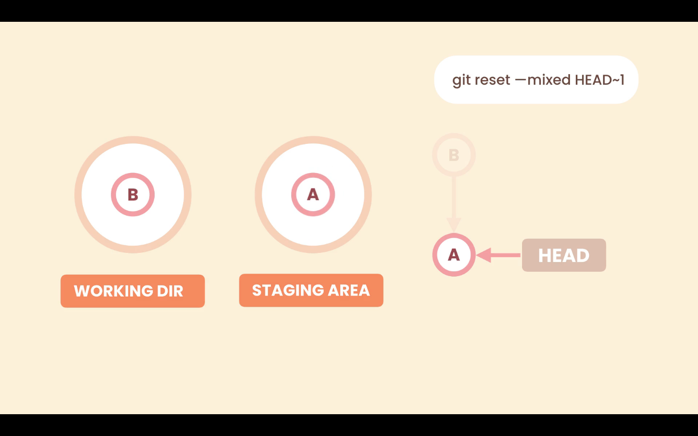

# Undoing Commits

If we have pushed a commit to a public **Remote Repository** we should not remove it.

If we want to undo the last commit, we have two options:

- Revert commit -> The has been pushed to a public **Remote Repository**
- Reset commit -> The has not been pushed to a public **Remote Repository**

## Reset commit

Resetting a commit removes this commit from the history. We use the `reset` command and we have to give it the target commit. We can do that using the `HEAD~n` syntax, which means `n` commits back from the commit `HEAD` is pointing to usually the last commit.

```zsh
git reset --hard HEAD~1
```

### Options to the reset command

We have the following options:

- `--soft` -> Removes the commit only
- `--mixed` -> Unstages files
- `--hard` -> Discards local changes


#### Option --soft

The `--soft` option only changes the **Local Repository**. Removes the commit only.

If we use `git reset --soft HEAD~1`, Git will point `HEAD` to the target location, in the **Local Repository**, but it is not going to touch the **Staging Area** and **Working Directory**.


#### Option --mixed

The `--mixed` option will change the **Local Repository** and the **Staging Area**. We go one step back, it will unstage the changes.

With the `--mixed` option Git will move the `HEAD` pointer, from `A` to `B` as in the `--soft` option, and will put the last snapshot in the **Staging Area** as well, but it will not touch the **Working Directory**.



#### Option --hard

The `--hard` option will change the **Local Repository**, **Staging Area**, and the **Working Directory**. Even one more step back, discards local changes.

With the `--hard` option Git will move the `HEAD` pointer, from `A` to `B` as in the `--soft` option, and it will put the last snapshot in the **Staging Area** and the **Working Directory**. So the new changes in the **Working Directory** will be gone.


